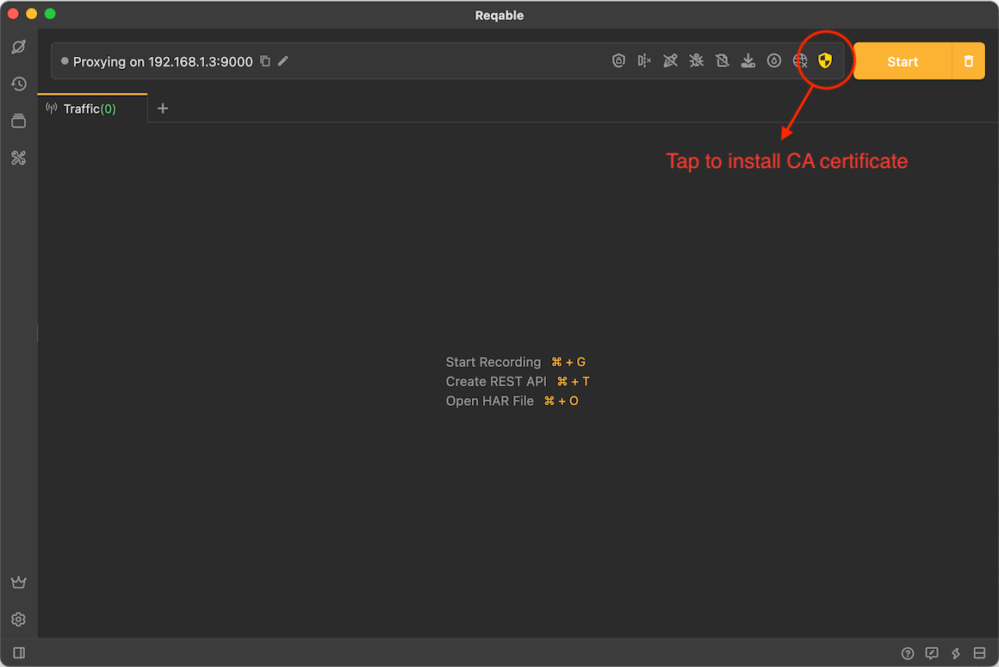
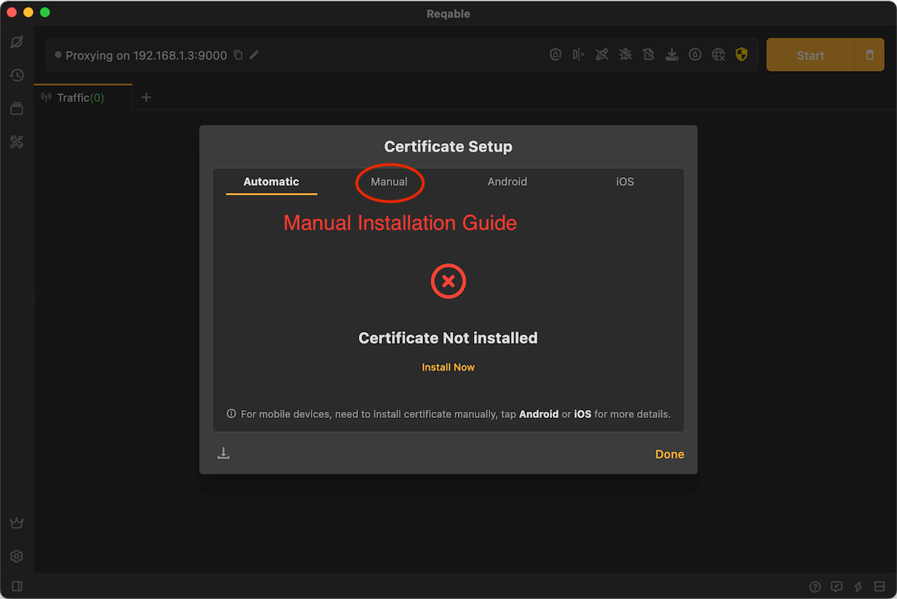
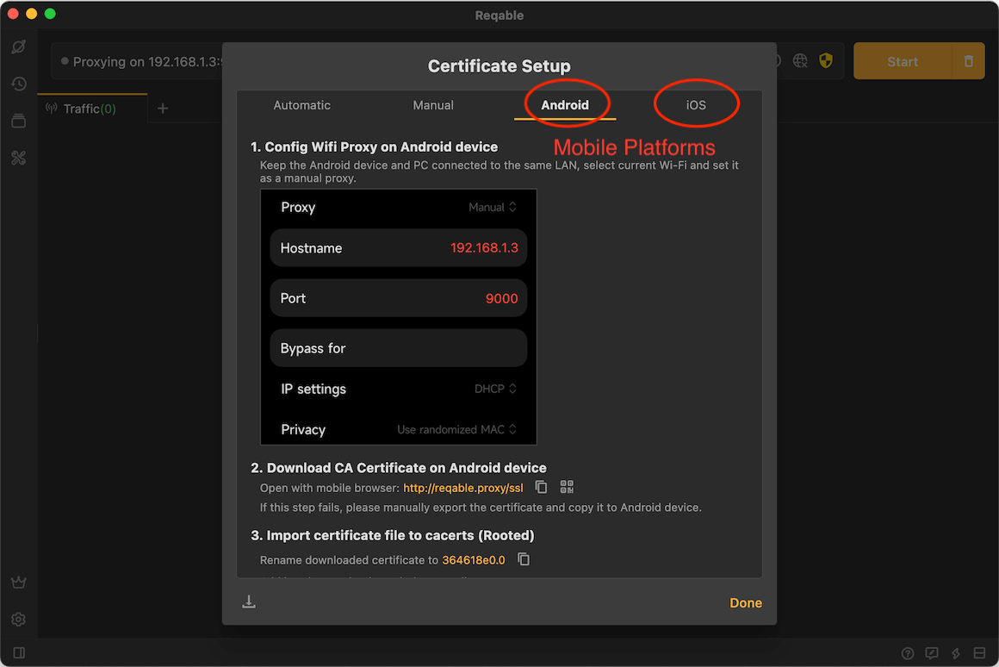

## Why should install a certificate?

Reqable uses the classic man-in-the-middle (MITM) technique to analyze HTTPS traffic. When the client communicates with Reqable proxy server (hereinafter referred to as `MITM`), the MITM needs to re-sign the SSL certificate of the remote server. In order to ensure the successful SSL handshake communication between the client and the MITM, it is necessary to install the MITM's root certificate (hereinafter referred to as `CA Certificate`) to the client's local certificate management center.

If the target client is a PC application, the CA Certificate needs to be installed in the certificate management center of the PC; if the target client is a mobile application, the CA certificate needs to be installed in the certificate management center of the mobile phone. If you do not need traffic analysis, you can ignore this step.

:::info Tips
Reqable automatically generates a CA certificate for each user, and uses a random certificate key, so you don't have to worry about this certificate being exploited by a third party.
:::

## Desktop

Different desktop platforms (here mainly Windows/MacOS/Linux) have different certificate installation methods. In order to simplify the installation process, Reqable provides a one-click certificate installation way.

The certificate installation page is located on the top QuickBar, click the shield icon to open the pop-up window.

Just click `Install Now`:

After clicking, the system will pop up a confirmation pop-up window or enter the account password to authorize, just follow the prompts to confirm. If there is no accident, the certificate will be automatically installed successfully; if the automatic installation fails, you can switch to the Tab of `Manual` and follow the steps to install it manually.

Note that Chrome and Firefox on Linux devices have built-in certificate management systems, and you also need to install the CA certificate into the browser's certificate management center. Please follow the prompts in Reqable.

:::info Installation Status
When the CA certificate is not installed or the installation fails, the shield icon is displayed in yellow; after the installation is successful, the shield icon is displayed in green.
:::

## Mobile

If you need to analyze mobile applications, you must install the CA certificate on the mobile device. We have built-in guidelines for installing Android and iOS certificates in Reqable, please switch to the tabs of `Android` and `iOS` to follow the steps to install.

:::info Tips
Since Android 7.0 does not trust user certificates, you need to install the CA certificate to the system certificate directory, which requires you to be able to root the device and remount system.
:::