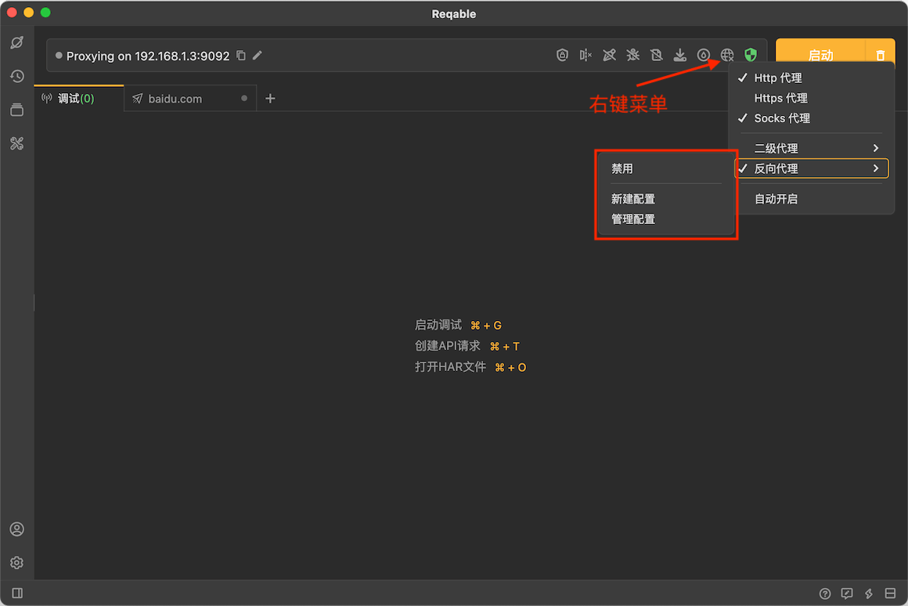
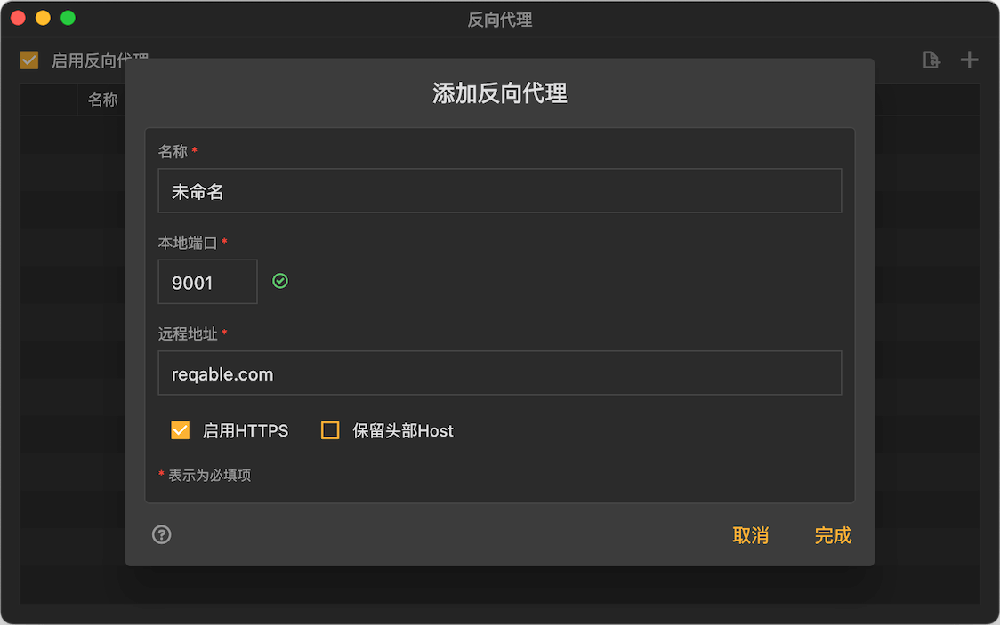
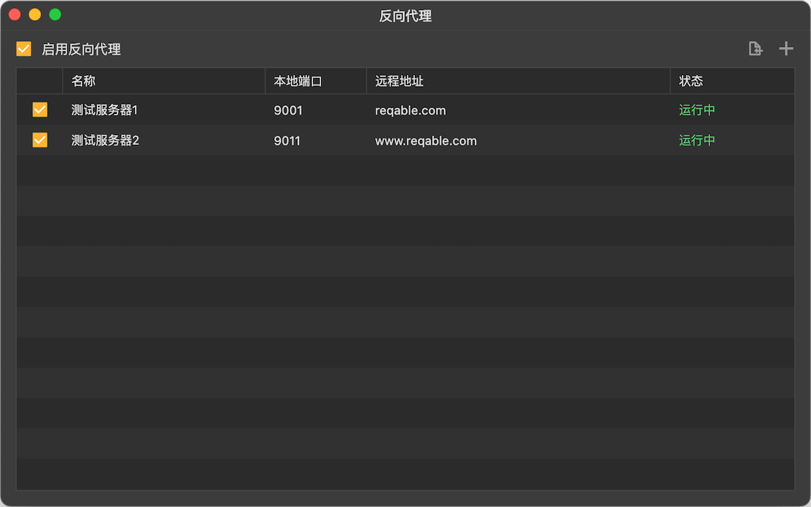

# 反向代理

Reqable支持创建本地Web服务器，透明地将流量代理到远程服务器，同时Reqable将捕获这些流量并支持进行重写、脚本和断点等调试功能。

### 原理

开发者需要在Reqable中配置：一个本地Web服务器端口（假设为`9001`）和被代理的远程服务器地址（假设为`test.com`）。配置完成后，Reqable将自动创建此本地Web服务器，监听端口`9001`。开发者在代码中将请求地址由`https://test.com`变更为`http://localhost:9001`，所有请求的流量都将发送到本地Web服务器。本地Web服务器会透明地将流量转发到实际的远程服务器`test.com`。在此过程中，Reqable会对流量进行拦截并显示到流量列表中。

如果是在远程设备上进行调试，需要将上文中的`localhost`替换为PC设备的IP地址（例如`192.168.1.3`），此IP地址一般会显示在Reqable主界面的顶部。

### 使用场景

部分应用程序的网络框架可能不支持设置网络代理，或者不支持使用系统设置中的网络代理配置，在这些情况下Reqable将无法对其进行流量分析和调试。反向代理便是用来解决此类问题的。

:::info 注意
如果您使用的应用程序网络框架支持配置代理，那么直接配置成Reqable的代理服务器地址，会比使用`反向代理`更有效率。
:::

使用反向代理还有如下优势：
- 原本的HTTPS请求变成了与本地Web服务器通信的明文请求，所以客户端无需再安装CA根证书。
- 远程设备只需要保证与PC设备在同一个局域网内，无需设置Wifi代理。

使用反向代理会有如下劣势：
- 使用反向代理的网络请求效率将有所降低。
- Reqable目前不支持WebSocket的反向代理。

### 使用方式

Reqable支持配置多个反向代理并进行管理。我们可以从`代理图标`的右键菜单中创建反向代理，也可以从应用顶部菜单`代理`中创建。

创建的时候按照下图输入`名称`，`本地端口`和`远程地址`，默认情况下Reqable会自动选择一个本地端口，如果您发现端口被占用了，请手动修改。如果`远程地址`使用默认端口号（HTTP默认80，HTTPS默认443）可以忽略，如果使用非默认端口号，则不可忽略，例如`reqable.com:3000`。

:::caution
- 远程设备（例如手机平板）使用反向代理前，请确保电脑网络防火墙已开放设置的`本地端口`。
- 在头部中保留Host功能需要谨慎使用，您的远程服务器可能会因Host不匹配而拒绝请求。
:::

反向代理创建完成后，可以在下图的列表中进行管理。在列表中，每个反向代理本地服务器的状态都会实时显示，如果发现启用失败（大概率是本地端口冲突了），可以点击进入编辑页面进行修改。

